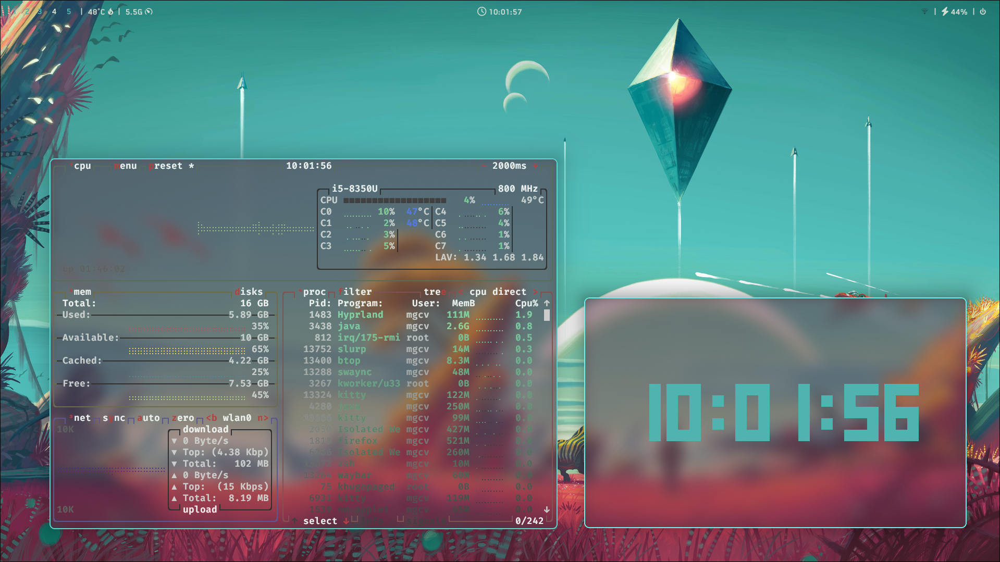
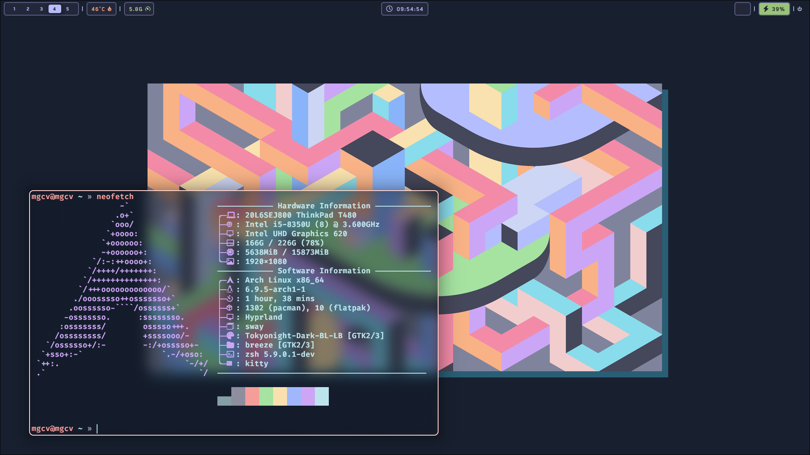
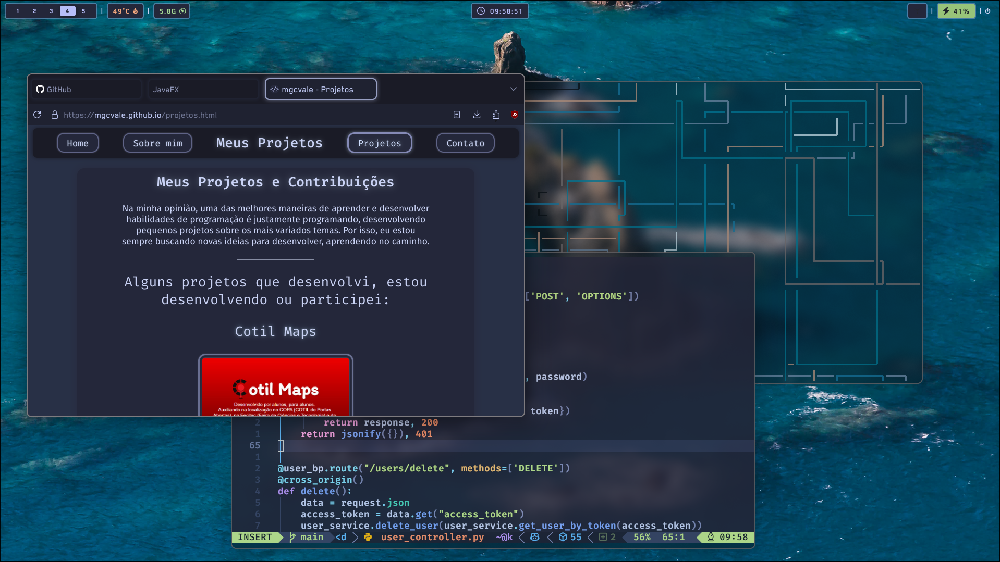

# hypr-dots
The dotfiles of my personal [Hyprland](https://hyprland.org) install.
Mainly based on the dotfiles of [Matt-FTW](https://github.com/Matt-FTW/dotfiles) and [JaKooLit](https://github.com/JaKooLit/Hyprland-Dots), with some personal touches added to it.

# Packages:
- Hyprland WM
- Kitty terminal
- zsh shell
- Waybar
- Firefox
- rofi and wofi
- btop
- neofetch
- thunar file manager
- Kvantum Manager
- nwg-look
- wal
- neovim
- swaync
- swappy
- pywal

# Screenshots

<html>
   
  
  

  
  

  
</html>
